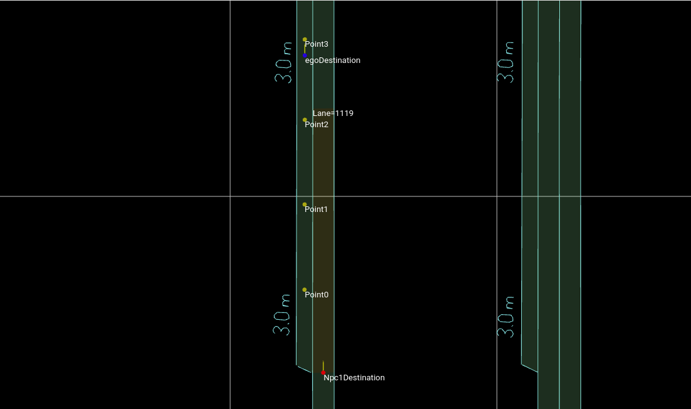

# CalcTrajectoryPoint 

This program provides a function to get fixed distanced points on lane-coordinate creating a trajectory for FollowTrajectoryAction scenario. Calculating points needs lanelet2 and lanelet2_extension libraries.

## Usage
1. pull the branch(https://github.com/soblin/autoware_common/tree/feat/python-binding) and build autoware to install lanelet2 and lanlet2_extension.
2. set this dirctory under autoware.
3. change calcAllTrajectoryPoints function's parameters of main as you need. 
    Also make sure map path fits to your environment.
    Parameters detail is written below Functions section.
4. run `python3 calcTrajectoryPoint.py`

## Functions

### calcAllTrajectoryPoints

Calculates a list of trajectory points.

#### Args
- laneID_list: List of laneID which NPC should follow
- start_offset: Offset value of beginning points of FollowTrajectoryAction.
- start_s: s(length) value of beginning points of FollowTrajectoryAction.
- target_length: The constant distance between one point to another which constructs trajectory.
- lane_resolution: The resolution when we separate target_lane into points.
- tolerance: Tolerance to find a point of target_length from start. 0.1 means the result distance provided by this function at most has 0.1[m] diffarence.

#### Returns
- list of laneID and trajectory points if it exists.
  - Also cullentry output the result on terminal.
- None if the trajectory cannot be created perfectly. 

### setNextTrajectoryPoint

Calculates single trajectory from `start_lane` to `target_lane`

#### Args
- start_lane: laneID of NPC's current lane.
- start_offset: Offset value of beginning points of FollowTrajectoryAction.
- start_s: s(length) value of beginning points of FollowTrajectoryAction.
- target_length: The constant distance between one point to another which constructs trajectory.
- target_lane: laneID of next NPC's target point.
- lane_resolution: The resolution when we separate target_lane into points.
- tolerance: Tolerance to find a point of target_length from start. 0.1 means the result distance provided by this function at most has 0.1[m] diffarence.

#### Returns
- (offset, s) value of target lane if it exists. value type is `lanelet2.geometry.ArcCoordinates`
- None if this function cannot find any point at target_distance. 

## Example

### input
```
if __name__ == "__main__":
    proj = MGRSProjector(lanelet2.io.Origin(0.0, 0.0))
    ll2_map = lanelet2.io.load("/home/keisuke-ota/autoware_map/followtrajectoryaction_scenario/lanelet2_map.osm", proj)

    calcAllTrajectoryPoints(laneID_list=[1119,41,48],\
                            start_offset=0,\
                            start_s=0,\
                            target_length=16.0,\
                            lane_resolution=0.1,
                            tolerance=0.1)
```

### output
```
<frozen importlib._bootstrap>:241: RuntimeWarning: to-Python converter for std::shared_ptr<lanelet::Projector> already registered; second conversion method ignored.
1119	0.0	0.0
41	14.899999999999988	-0.0
41	30.89999999999991	-0.0
41	46.800000000000125	-0.0
48	13.899999999999983	0.0
```

